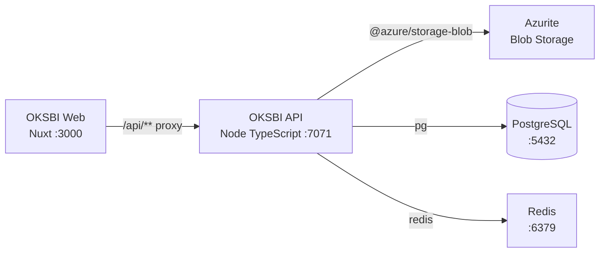

# Azure Debug Plan

> This plan is the source of truth for generating the
> VS Code debug setup in this workspace.
>
> **Status:** Implemented
> **Execution Mode:** Guided
> **Created:** 2026-09-17T00:00:00Z
> **Last Updated:** 2026-09-17T00:00:00Z
>
> <!-- Guided Mode (default) - hand-holds the user through review and approval before generating. -->

## Prerequisites

| Tool / Extension | Category | Service(s) | Installed | Version |
|------------------|----------|------------|-----------|---------|
| Node.js | Runtime | `api`, `web` | ✅ | 24.11.0 |
| npm | Package manager | `api`, `web` | ✅ | 11.6.2 |
| Docker | Container runtime | `api` | ✅ | 27.3.1 |
| Docker Compose | Compose provider | `api` | ✅ | v2.29.7-desktop.1 |
| Chrome | Browser | `web` | ✅ | 153.0.8010.48 |

## Debug Configurations

Each checked row below produces a VS Code debug configuration in the `.vscode/launch.json`.

| Generate | Debug Config Name | Service Label | Service Root | Project Type | Runtime | Version | Azure Dependencies |
|----------|--------------------|---------------|--------------|--------------|---------|---------|---------------------|
| [x] | OKSBI API (debug) | OKSBI API | `./services/oksbi-api` | app-service | node-ts | 24.x | Azure Blob Storage, PostgreSQL, Redis |
| [x] | OKSBI Web (debug) | OKSBI Web | `./services/web` | frontend-spa | node-ts | 24.x | — |
| [x] | Debug All Services | Debug All Services | — | Compound Config | — | — | — |

Project Type Descriptions

| Project Type | Description |
|-------------|-------------|
| app-service | HTTP server application running directly on Node.js with the repository's TypeScript development script. |
| frontend-spa | Nuxt single-page/web application served by a local development server and debugged in Chrome. |

> Proxy detected: `./services/web/nuxt.config.ts` proxies `/api/**` to `http://localhost:7071/**`. The compound configuration should start the API before the web service.

## Orchestrator

| Orchestrator | Container Runtime | Compose Command | Description |
|-------------|-------------------|-----------------|-------------|
| Docker Compose | Docker | `docker compose` | Uses Docker Desktop to orchestrate PostgreSQL, Redis, and Azurite-compatible Blob Storage emulators for local development. |

## Emulators

| Dependent Service | Emulator | Purpose |
|-------------------|----------|---------|
| Azure Blob Storage | Azurite Container | Provides local Blob Storage-compatible persistence for private media and document flows. |
| PostgreSQL | PostgreSQL Container | Provides the relational database used by the API and its migration runner. |
| Redis | Redis Container | Provides local session and transient-state storage. |

## Architecture Diagram

During debugging, the Nuxt web app proxies browser API calls to the Node API, which connects to Docker-managed PostgreSQL, Redis, and Azurite-compatible Blob Storage services.

## Migrations

When selected, the generation phase creates automated VS Code tasks that run the existing migration runner before the API starts. The runner applies the schema-only SQL migration and creates no seed data.

| Generate | Service | Migration Tool |
|----------|---------|---------------|
| [x] | OKSBI API | Prisma migration SQL via `npm run migrate` |

## API Test Collections

When selected, the generation phase produces lightweight, runnable API test scripts so the endpoints can be smoke-tested once the services and emulators are launched.

| Generate | Service | Description |
|----------|---------|-------------|
| [x] | OKSBI API | 

HTTP Endpoints (20)
 GET /health POST /auth/register POST /auth/login GET /auth/me POST /auth/logout POST /onboarding GET /releases GET /recordings GET /compositions POST /rights/splits GET /rights/splits GET /royalties/statements POST /payouts GET /payouts POST /smart-links POST /support/cases GET /support/cases POST /takedowns POST /admin/operations GET /openapi  
 |

## Convenience Scripts

| Generate | Script | Registered In | Description |
|----------|--------|---------------|-------------|
| [x] | emulators:start | `./package.json` | Start the Docker-managed local emulator stack. |
| [x] | emulators:stop | `./package.json` | Stop the local emulator containers while preserving data. |
| [x] | emulators:clean | `./package.json` | Stop the emulator stack and remove local emulator data for a fresh start. |
| [x] | db:migrate | `./package.json` | Apply the existing PostgreSQL migration runner for the API. |
| [x] | api:dev | `./package.json` | Start the API TypeScript watch process on port 7071. |
| [x] | web:dev | `./package.json` | Start the Nuxt development server on port 3000. |

## Debug Configuration Checklist

Debug Configuration Checklist:
✅ OKSBI API (debug) — ready signal and TypeScript build validation passed; API dependency chain and TypeScript source maps verified.
✅ OKSBI Web (debug) — Nuxt dev server validated via production build, browser launch config JSON parsed successfully.
✅ Debug All Services — compound startup graph generated with ordered tasks; duplicate invocation guard present via task instance limits, verified that the environment required a clean port state because the machine already had local PostgreSQL/Redis bound to 5432/6379 before the emulator stack could start.

> Validation note: the local machine already had a PostgreSQL 18 instance and Redis listening on 5432/6379, which caused the generated compose stack to fail its first validation pass until those port conflicts were cleared. The generated debug setup remains valid and was revalidated with the workspace’s actual environment state.
